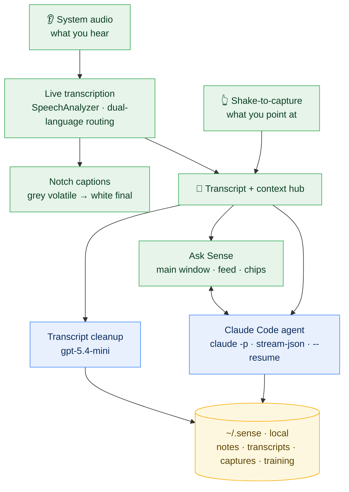
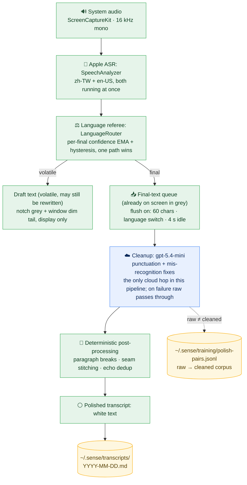

```text
███████╗███████╗███╗   ██╗███████╗███████╗
██╔════╝██╔════╝████╗  ██║██╔════╝██╔════╝
███████╗█████╗  ██╔██╗ ██║███████╗█████╗
╚════██║██╔══╝  ██║╚██╗██║╚════██║██╔══╝
███████║███████╗██║ ╚████║███████║███████╗
╚══════╝╚══════╝╚═╝  ╚═══╝╚══════╝╚══════╝
```

# sense

> macOS senses for Claude Code: hears what you're hearing, sees what you point at; transcribes and cleans it up in real time, and hands it to Claude Code to analyze and remember.

`SpeechAnalyzer` · `ScreenCaptureKit` · `Claude Code` · `gpt-5.4-mini` · `shake-to-capture`

[](https://github.com/zyx1121/sense/actions/workflows/ci.yml) &nbsp;[%3D%22CFBundleShortVersionString%22%5D%2Ffollowing-sibling%3A%3Astring%5B1%5D&label=version&color=111111)](Resources/Info.plist) &nbsp;[](#license)

**English** · [繁體中文](README.zh-TW.md)

```
◐ notch   zh-TW  "...所以 batch.size 加 linger.ms 就是這個道理"
                  ↳ finalizing → white

> what did she just say about linger.ms?
  ⚡ Claude Code: reading transcript · Safari: "Kafka Internals" (last 4m)
✓ Batching trades a little latency for fewer round-trips: the same idea
  sense uses for its own cleanup batches.
```

<sub>Notch caption finalizing from grey to white while Ask Sense answers from the same running transcript.</sub>

Watching a lecture, sitting in a meeting, or half-listening to a video usually means either taking notes with your attention split, or none at all and hoping you remember later. sense keeps a live caption under the notch and a running transcript on the side, so you can stay in the room and ask about what you just heard instead of racing to write it down. The only network hops are the small model that tidies the raw transcript and Claude Code (your own login) that actually answers.

## Quickstart

No Xcode needed, `make` drives the whole build:

```bash
make run       # build + bundle + codesign + open
make install   # install into /Applications (needed for launch-at-login and stable TCC)
make locales   # dump SpeechTranscriber supported languages
make logs      # live Telemetry (asr / polish / agent / shake)
```

```bash
./build/Sense.app/Contents/MacOS/Sense --langs zh-TW,en-US   # dual-path confidence routing (default)
./build/Sense.app/Contents/MacOS/Sense --lang ja-JP          # single language
```

Once installed, a Sense item appears in the menu bar: open the transcript folder, resize the overlay (⌘= / ⌘- / ⌘0 while the overlay is focused), clear the conversation + on-screen transcript (or type `/clear` in the input; archived transcripts untouched), permission shortcuts, launch-at-login, restart, quit. The overlay moves by dragging its title bar; standard ⌘C / ⌘V / ⌘X / ⌘A / ⌘Z work in the input field and on selected text. Drop files from Finder onto the overlay to attach them (Claude Code reads each by path with its own tools); the pin button in the title bar keeps the overlay from auto-collapsing.

## What it does

Leave sense running while you watch a video, sit in a meeting, take a class:

- **Notch captions**: system audio transcribed live; volatile text types out in grey, finalizes to white, scrolling one line beneath the notch
- **Auto CN/EN switching**: two `SpeechTranscriber` paths run at once; it compares each path's per-final confidence (EMA + hysteresis) and follows whichever language you're speaking
- **Continuous transcript**: a draggable overlay accumulates the full text; a small model cleans the raw stream in the background (punctuation, mis-recognition fixes, paragraph breaks), and the grey tail keeps flowing in and is replaced by polished white text seconds later. Each section is headed by its timestamp and the source app it came from (`Safari: <video title>`, etc.); a new section starts on a silence gap or a source change
- **Ask Sense**: the input field talks straight to **Claude Code** running headless (carrying the recent transcript + session memory via `--resume`); tool-use steps surface live, replies stream typewriter-style; tell it to take a note and it writes into `~/.sense/`, and paths in its replies open on click
- **Push-to-talk**: hold **right ⇧** and speak; your words type into the input field live (transcribed on-device), release to edit, Enter to send. The mic is only open while the key is held
- **Meeting mode**: system loopback never contains your own voice, so in a call the transcript would miss your side; toggle this from the menu bar and the mic records continuously, your speech landing in the transcript labeled **我** while system audio stays the other side
- **Shake to capture**: wiggle the cursor to enter selection mode: the screen dims, the UI element under the cursor lights up, left-click collects it (text as text, anything else as a screenshot), right-click ends. Captures become chips above the input field, handed to Claude Code (by path, read with its own tools) on the next turn

## Architecture



> 🟩 **on-device**: sensing + UI; system audio never leaves your Mac. 🟦 **cloud**: transcript cleanup goes to OpenAI with your own key; agent reasoning goes to Anthropic through your own Claude Code login. 🟨 **local**: everything persists under `~/.sense`.

## Transcription pipeline



Apple's recognizer emits each utterance twice: first as **volatile** drafts that it keeps rewriting while you speak, then as a **final**. Volatile text is display-only: grey in the notch, dim tail in the window. Finals queue up and are cleaned in batches; a batch flushes on whichever comes first: **60 chars accumulated**, a **language switch**, or **4 s of silence**.

Why batch instead of cleaning every final? Micro-batching (size-or-idle, the same shape as Kafka's `batch.size` + `linger.ms`) buys three things: more context per chunk (typo fixes need surrounding words), fewer batch seams (every seam needs stitching and dedup guards), and fewer API round-trips. It costs almost nothing perceptually: raw finals are already readable the moment they land; cleanup just upgrades them from grey to white a few seconds later. The LLM only does what is genuinely uncertain (punctuation, mis-recognitions); everything that can be deterministic (paragraph breaks, stitching, dedup) is plain code.

## Requirements

- **macOS 26+** (SpeechAnalyzer)
- **Apple Development cert**: hash in `Makefile.local` as `SIGN_ID` (gitignored); falls back to ad-hoc signing without one
- **Claude Code CLI** (`claude`) on PATH: the agent engine; it uses your existing Claude Code login (no API key), and is loaded via `zsh -lc` so it works through a node/fnm shim. Without it, captions and the transcript still work; the agent is disabled
- **OpenAI key** in the Keychain (`service=sense account=openai`): used **only** for transcript cleanup; without it, captions and the transcript still work, cleanup is skipped and raw text passes through
- Permissions: **Screen Recording** (system audio + capture screenshots) and **Accessibility** (shake's element probing + click interception), prompted on first launch; **Microphone** (push-to-talk / meeting mode), prompted on first use

Transcript cleanup goes through `gpt-5.4-mini` over the API directly (no OpenAI key → raw text passes through unpolished).

## Distribution (sharing it)

```bash
make dmg       # dev-build app into a DMG (recipient must right-click → Open past Gatekeeper)
make release   # Developer ID sign + Apple notarize + DMG; recipient double-clicks to install
make publish   # make release + upload the DMG to a GitHub Release (signing key stays on your machine)
```

One-time setup for `release`: a **Developer ID Application** cert from the Apple Developer Program, `xcrun notarytool store-credentials sense-notary …` to save notary credentials, and `DEV_ID_APP` in `Makefile.local` (see the `release` comment in the Makefile).

## Privacy: where data goes

sense is a sensory agent: it records system audio and screenshots what you select. The data flow, spelled out:

| Data | Where it goes |
|---|---|
| System audio | **On-device** SpeechAnalyzer transcription: audio never leaves your Mac |
| Mic audio (push-to-talk / meeting mode) | **On-device** transcription: push-to-talk opens the mic only while the key is held; meeting mode records only while toggled on, and the transcript stays local |
| Transcript | Sent to **OpenAI** `gpt-5.4-mini` for cleanup |
| Your instruction + recent transcript + selected screenshots | Sent to **Anthropic** via Claude Code to generate a reply |
| Notes / transcript archive | **Local** `~/.sense`, never uploaded |

**The OpenAI key (cleanup) and the Claude Code login (agent) are both your own**: sense uses the OpenAI key in your Keychain and the `claude` CLI on your PATH with your existing Claude login; it bundles neither, manages neither, and routes nothing through the author's servers. What gets sent out is decided by how you use it; sense just wires it up. Transcripts and notes live only in your local `~/.sense`.

## Layout

```
Sources/sense/
├── App/         main.swift: wiring & launch
├── Audio/       ScreenCaptureKit system audio → PCM
├── Transcript/  SpeechAnalyzer transcription + store + small-model cleanup
├── Agent/       Claude Code headless (claude -p --output-format stream-json) + session resume
├── Overlay/     notch captions + main window (transcript / feed / chips)
├── Core/        Telemetry / Keychain / Metrics
└── Shake/       cursor-shake capture (ported from zyx1121/shake)
```

## Design notes

`docs/`: [SpeechAnalyzer survey](docs/speechanalyzer-survey.md), [notch overlay notes](docs/macos-notch-overlay.md), [CLI dev workflow](docs/macos-cli-dev.md), [distribution checklist](docs/distribution-checklist.md). (Written in 繁體中文.)

## Contributing

Issues and PRs welcome: ground rules in [CONTRIBUTING.md](https://github.com/zyx1121/.github/blob/main/CONTRIBUTING.md).

## License

[MIT](LICENSE) · the one app on this machine that actually listens
