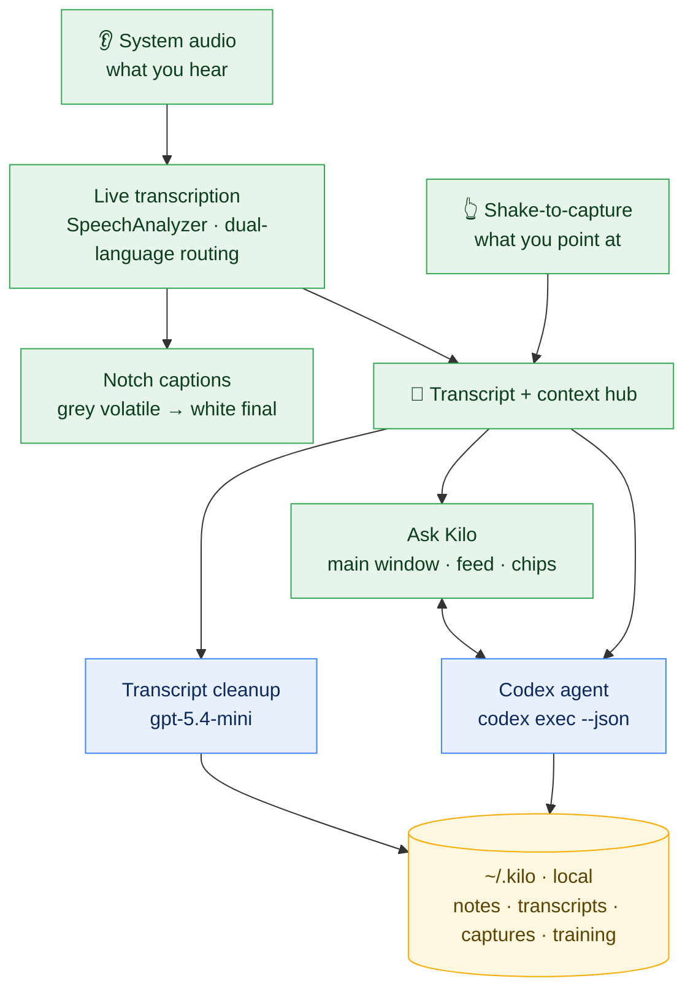

```text
██╗  ██╗██╗██╗      ██████╗
██║ ██╔╝██║██║     ██╔═══██╗
█████╔╝ ██║██║     ██║   ██║
██╔═██╗ ██║██║     ██║   ██║
██║  ██╗██║███████╗╚██████╔╝
╚═╝  ╚═╝╚═╝╚══════╝ ╚═════╝
```

# kilo-sense

> macOS sensory agent — hears what you're hearing, sees what you point at; transcribes, cleans up, analyzes, and remembers, in real time.

`SpeechAnalyzer` · `ScreenCaptureKit` · `codex` · `gpt-5.4-mini` · `shake-to-capture`

**English** · [繁體中文](README.zh-TW.md)

## What it does

Leave kilo-sense running while you watch a video, sit in a meeting, take a class:

- **Notch captions** — system audio transcribed live; volatile text types out in grey, finalizes to white, scrolling one line beneath the notch
- **Auto CN/EN switching** — two `SpeechTranscriber` paths run at once; it compares each path's per-final confidence (EMA + hysteresis) and follows whichever language you're speaking
- **Continuous transcript** — a draggable overlay accumulates the full text; a small model cleans the raw stream in the background (punctuation, mis-recognition fixes, paragraph breaks) — the grey tail keeps flowing in and is replaced by polished white text seconds later
- **Ask Kilo** — the input field talks straight to a codex agent (carrying the recent transcript + session memory); tool-use steps surface live, replies stream typewriter-style; tell it to take a note and it writes into `~/.kilo/`, and paths in its replies open on click
- **Shake to capture** — wiggle the cursor to enter selection mode: the screen dims, the UI element under the cursor lights up, left-click collects it (text as text, anything else as a screenshot), right-click ends. Captures become chips above the input field, handed to codex on the next turn

## Architecture



> 🟩 **on-device** — sensing + UI; system audio never leaves your Mac. 🟦 **cloud** — your own OpenAI key / codex CLI (cleanup + reasoning only). 🟨 **local** — everything persists under `~/.kilo`.

## Pipeline

```
system audio (ScreenCaptureKit) ─→ SpeechAnalyzer ─→ notch captions (volatile/final)
                                      │
                                      └→ continuous transcript ─→ small-model cleanup (gpt-5.4-mini)
                                                                        │
cursor shake ─→ dim + AX spotlight ─→ click to capture ── chips ──────→ codex exec (resume session) ─→ feed
```

## Running it (no Xcode)

```bash
make run       # build + bundle + codesign + open
make install   # install into /Applications (needed for launch-at-login and stable TCC)
make locales   # dump SpeechTranscriber supported languages
make logs      # live Telemetry (asr / polish / agent / shake)
```

Once installed, a Kilo item appears in the menu bar — open the transcript folder, permission shortcuts, launch-at-login, restart, quit.

## Distribution (sharing it)

```bash
make dmg       # dev-build app into a DMG (recipient must right-click → Open past Gatekeeper)
make release   # Developer ID sign + Apple notarize + DMG; recipient double-clicks to install
make publish   # make release + upload the DMG to a GitHub Release (signing key stays on your machine)
```

One-time setup for `release`: an **Developer ID Application** cert from the Apple Developer Program, `xcrun notarytool store-credentials kilo-notary …` to save notary credentials, and `DEV_ID_APP` in `Makefile.local` (see the `release` comment in the Makefile).

Requirements:

- **macOS 26+** (SpeechAnalyzer)
- **Apple Development cert** — hash in `Makefile.local` as `SIGN_ID` (gitignored); falls back to ad-hoc signing without one
- **codex CLI** on PATH (the agent engine; loaded via `zsh -lc`, works through an fnm shim)
- **OpenAI key** in the Keychain (`service=kilo account=openai`) — used by the agent and transcript cleanup; without it, captions and the transcript still work, the agent is disabled
- Permissions: **Screen Recording** (system audio + capture screenshots) and **Accessibility** (shake's element probing + click interception), prompted on first launch

Transcript cleanup goes through `gpt-5.4-mini` over the API directly (no OpenAI key → raw text passes through unpolished).

```bash
./build/kilo-sense.app/Contents/MacOS/kilo-sense --langs zh-TW,en-US   # dual-path confidence routing (default)
./build/kilo-sense.app/Contents/MacOS/kilo-sense --lang ja-JP          # single language
```

## Privacy — where data goes

kilo-sense is a sensory agent: it records system audio and screenshots what you select. The data flow, spelled out:

| Data | Where it goes |
|---|---|
| System audio | **On-device** SpeechAnalyzer transcription — audio never leaves your Mac |
| Transcript | Sent to **OpenAI** `gpt-5.4-mini` for cleanup |
| Your instruction + recent transcript + selected screenshots | Sent to **codex / OpenAI** to generate a reply |
| Notes / transcript archive | **Local** `~/.kilo`, never uploaded |

**The key and codex are your own** — kilo-sense uses the OpenAI key in your Keychain and the codex CLI on your PATH; it bundles neither, manages neither, and routes nothing through the author's servers. What gets sent to OpenAI is decided by how you use it; kilo-sense just wires it up. Transcripts and notes live only in your local `~/.kilo`.

## Layout

```
Sources/kilo-sense/
├── App/         main.swift — wiring & launch
├── Audio/       ScreenCaptureKit system audio → PCM
├── Transcript/  SpeechAnalyzer transcription + store + small-model cleanup
├── Agent/       codex exec --json streaming + session resume
├── Overlay/     notch captions + main window (transcript / feed / chips)
├── Core/        Telemetry / Keychain / Metrics
└── Shake/       cursor-shake capture (ported from zyx1121/shake)
```

## Design notes

`docs/` — [SpeechAnalyzer survey](docs/speechanalyzer-survey.md), [notch overlay notes](docs/macos-notch-overlay.md), [CLI dev workflow](docs/macos-cli-dev.md), [AX-actions feasibility](docs/ax-actions-survey.md), [distribution checklist](docs/distribution-checklist.md). (Written in 繁體中文.)
