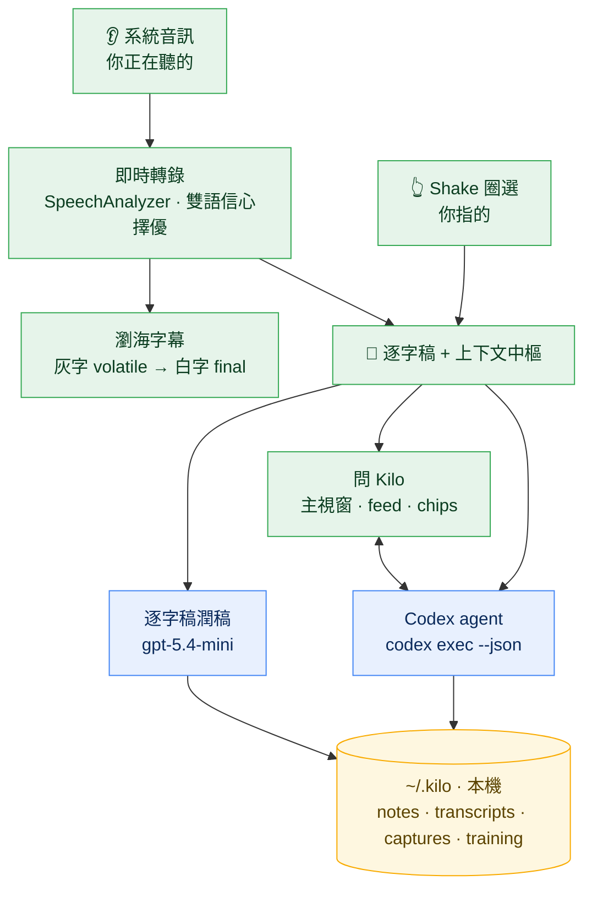
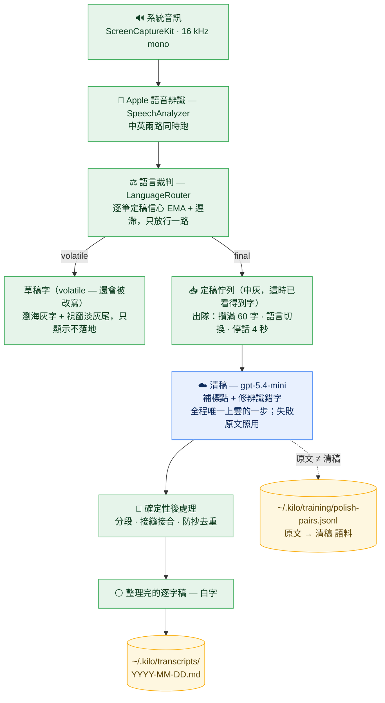

```text
██╗  ██╗██╗██╗      ██████╗
██║ ██╔╝██║██║     ██╔═══██╗
█████╔╝ ██║██║     ██║   ██║
██╔═██╗ ██║██║     ██║   ██║
██║  ██╗██║███████╗╚██████╔╝
╚═╝  ╚═╝╚═╝╚══════╝ ╚═════╝
```

# kilo-sense

> macOS 感官 agent — 聽見你在聽的、看見你指的，即時轉錄、整理、分析、記錄。

`SpeechAnalyzer` · `ScreenCaptureKit` · `codex` · `gpt-5.4-mini` · `shake-to-capture`

[English](README.md) · **繁體中文**

## 它做什麼

開著 kilo-sense 看影片、開會、上課：

- **瀏海字幕** — 系統音訊即時轉錄，volatile 灰字逐字打出、定稿轉白，瀏海下方一行流過
- **中英自動切換** — 兩路 SpeechTranscriber 同時轉錄，比較各路定稿信心（EMA + 遲滯），講到哪個語言就自動走哪路
- **連續逐字稿** — 可拖動的 overlay 視窗累積全文；小模型背景把生稿補標點、修辨識錯字、分段 — 灰字尾巴一直流入，幾秒後被整理過的白字取代。每個區段標頭顯示時間戳與來源 app（`Safari: <影片標題>` 等）；靜默 gap 或來源切換時開新區段
- **問 Kilo** — 輸入框直通 codex agent（帶最近逐字稿 + session 記憶），tool use 步驟即時浮出、回應打字機串流；說「記錄下來」它就寫筆記進 `~/.kilo/`，回覆裡的路徑點了直接開
- **按住說話** — 按住**右 ⇧** 對 Kilo 口述，文字即時打進輸入框（本機轉錄），放開可修改、Enter 送出；只有按住時 mic 才開著
- **會議模式** — 系統音訊裡沒有你自己的聲音，開會時逐字稿會少掉你這側；從選單列打開後 mic 持續錄，你的發言以「**我**」標進逐字稿、系統音訊維持對方那側
- **Shake 圈選** — 晃游標進選取模式：螢幕變暗、游標下的 UI 元素亮起，左鍵點擊收集（文字收文字、其他截圖），右鍵結束；素材變輸入框上方的 chips，下一輪丟給 codex 看圖分析

## 架構



> 🟩 **on-device** — 感知 + UI；系統音訊不離開你的 Mac。 🟦 **cloud** — 你自己的 OpenAI key / codex CLI（只做潤稿 + 推理）。 🟨 **本機** — 全部落在 `~/.kilo`。

## 轉錄 pipeline



Apple 辨識引擎每段話會吐兩次：先是**草稿（volatile）**——邊聽邊回頭改寫，講完才給**定稿（final）**。草稿只負責顯示——瀏海灰字、視窗淡灰尾巴，不落地。定稿進佇列攢批整理，三個條件先到先觸發：**攢滿 60 字**、**語言切換**、**停話 4 秒**。

為什麼攢批、不逐筆清？Micro-batching（滿量-或-閒置，跟 Kafka 的 `batch.size` + `linger.ms` 同款）換到三件事：單批上下文更厚（修錯字要靠前後文）、接縫更少（每個接縫都要接合與去重防線）、API 來回更少。而體感代價趨近零——定稿一落地就以灰字上畫面可讀，清稿只是幾秒後把它升級成白字。LLM 只做真正不確定的（標點、辨識錯字）；能確定的（分段、接合、去重）全是程式碼。

## 跑起來（不開 Xcode）

```bash
make run       # build + bundle + codesign + open
make install   # 裝進 /Applications（開機自啟與穩定 TCC 都需要）
make locales   # dump SpeechTranscriber 支援語言
make logs      # 即時看 Telemetry（asr / polish / agent / shake）
```

裝好後選單列會有 Kilo 圖示 — 開逐字稿資料夾、縮放 overlay（overlay 聚焦時 ⌘= / ⌘- / ⌘0）、清除對話與畫面逐字稿（或在輸入框打 `/clear`；已歸檔的不動）、權限設定、開機自啟、重啟、結束都在那。overlay 拖頂部標題列移動；輸入框與選取文字支援標準 ⌘C / ⌘V / ⌘X / ⌘A / ⌘Z。從 Finder 拖檔案到 overlay 上會變成附件（圖片直接給 agent 看、其他檔案給路徑）；標題列的釘選鈕可以讓 overlay 不自動收合。

## 分發（給別人）

```bash
make dmg       # 開發態 app 打成 DMG（對方需「右鍵 → 打開」繞過 Gatekeeper）
make release   # Developer ID 簽 + Apple 公證 + DMG，對方雙擊即裝
make publish   # make release + 傳上 GitHub Release（簽名私鑰不出本機）
```

`release` 一次性前置：Apple Developer Program 簽發 **Developer ID Application** cert、`xcrun notarytool store-credentials kilo-notary …` 存公證憑證、`Makefile.local` 設 `DEV_ID_APP`（見 Makefile `release` 註解）。

需求：

- **macOS 26+**（SpeechAnalyzer）
- **Apple Development cert** — hash 放 `Makefile.local` 的 `SIGN_ID`（gitignored），沒有就 ad-hoc 簽
- **codex CLI** 在 PATH（agent 引擎；`zsh -lc` 載入，fnm shim 也通）
- **OpenAI key** 在 Keychain（`service=kilo account=openai`）— agent 與逐字稿整理的 fallback 用；沒有 key 字幕與逐字稿照常，agent 停用
- 權限：**螢幕錄製**（系統音訊 + 圈選截圖）、**輔助使用**（shake 的元素探測與點擊攔截），首次啟動會提示；**麥克風**（按住說話 / 會議模式），首次使用時提示

逐字稿整理走 `gpt-5.4-mini` 直打 API（沒 OpenAI key → 原文直出，不整理）。

```bash
./build/Kilo.app/Contents/MacOS/Kilo --langs zh-TW,en-US   # 雙路信心擇優（預設）
./build/Kilo.app/Contents/MacOS/Kilo --lang ja-JP          # 單語模式
```

## 隱私 — 資料去哪

kilo-sense 是感官 agent，會錄系統音訊、截你圈選的畫面。資料流向講清楚：

| 資料 | 去哪 |
|---|---|
| 系統音訊 | **本機** SpeechAnalyzer 即時轉錄，音訊不離開你的 Mac |
| 麥克風（按住說話 / 會議模式） | **本機**轉錄 — 按住說話只在按住時開 mic；會議模式只在開關打開時錄，逐字稿留在本機 |
| 逐字稿 | 送 **OpenAI** `gpt-5.4-mini` 整理潤稿 |
| 你的指令 + 最近逐字稿 + 圈選截圖 | 送 **codex / OpenAI** 產生回應 |
| 筆記 / 逐字稿存檔 | **本機** `~/.kilo`，不上傳 |

**key 與 codex 都是你自己的** — kilo-sense 用你 Keychain 裡的 OpenAI key、你 PATH 上的 codex CLI，不內建、不代管、不經過作者的任何伺服器。送什麼給 OpenAI 由你的使用決定，kilo-sense 只是把它接起來；逐字稿與筆記只存在你本機的 `~/.kilo`。

## 結構

```
Sources/kilo-sense/
├── App/         main.swift — 接線與啟動
├── Audio/       ScreenCaptureKit 系統音訊 → PCM
├── Transcript/  SpeechAnalyzer 轉錄 + store + 小模型整理
├── Agent/       codex exec --json 串流 + session resume
├── Overlay/     瀏海字幕 + 主視窗（逐字稿 / feed / chips）
├── Core/        Telemetry / Keychain / Metrics
└── Shake/       晃游標圈選（ported from zyx1121/shake）
```

## 設計依據

`docs/` — [SpeechAnalyzer survey](docs/speechanalyzer-survey.md)、[瀏海 overlay 自刻筆記](docs/macos-notch-overlay.md)、[CLI 開發流程](docs/macos-cli-dev.md)、[AX 操作可行性](docs/ax-actions-survey.md)、[分發 checklist](docs/distribution-checklist.md)。
